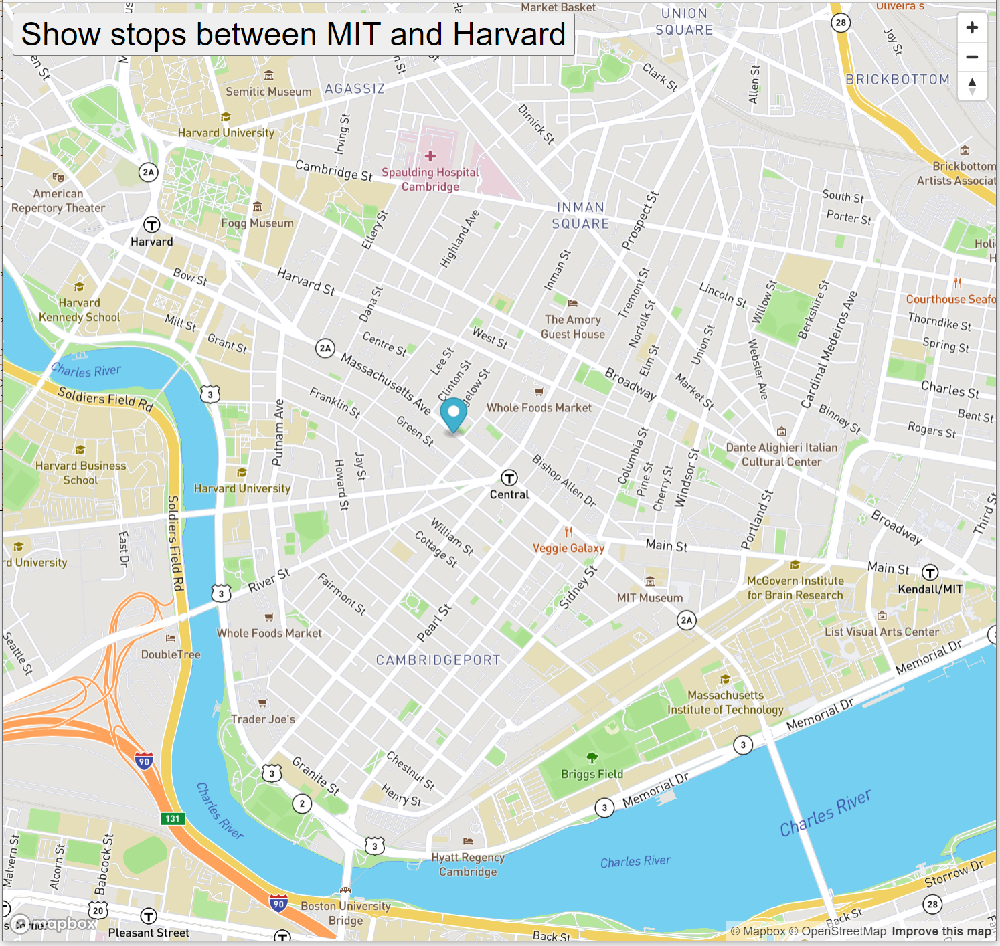

# Real-Time-Bus-Tracker

### **Description**: Week 09: Add animation to the map of stop-and-go at each bus stop between Massachusetts Institute of Technology campus and Harvard University campus using https://www.mapbox.com

Demonstrate web application using JavaScript, HTML, and CSS to move Map Marker:

<ul>
  <li>HTML: div element</li>
  <li>Stylesheet: class</li>
  <li>JavaScript: setTimeout()</li>
  <li>Applying recursive function</li>
  <li>Using API: https://www.mapbox.com/
    <ul>
      <li>JavaScript: https://api.mapbox.com/mapbox-gl-js/v1.11.0/mapbox-gl.js</li>
      <li>Stylesheet: https://api.mapbox.com/mapbox-gl-js/v1.11.0/mapbox-gl.css</li>
    </ul>
  </li>
</ul>

### **Installation**:
<ul><li>Fork the repository</li></ul>

### **Usage**:
<ul>
  <li>Create yourself an Access Key from https://www.mapbox.com/</li>
  <li>Paste your access key into mapanimation_round_trip.js</li>
  <li>Load index.html on your internet browser</li>
  <li>Click on Show stops between MIT and Harvard button</li>
  <li>To stop the animation, close your internet browser</li>
</ul>

### **Support**:
<ul><li>None.</li></ul>

### **Roadmap**:
<ul><li>None.</li></ul>

### **License information**:
<ul>
  <li>Some provided materials from the lecture videos and from assignment solutions are used in this project</li>
  <li>Some implementations are derived from the provided materials of the course:
    <ul>
      <li>index.html</li>
      <li>styles.css</li>
    </ul>
  </li>
  <li>mapanimation_round_trip.js was derived from a class template file</li>
</ul>
